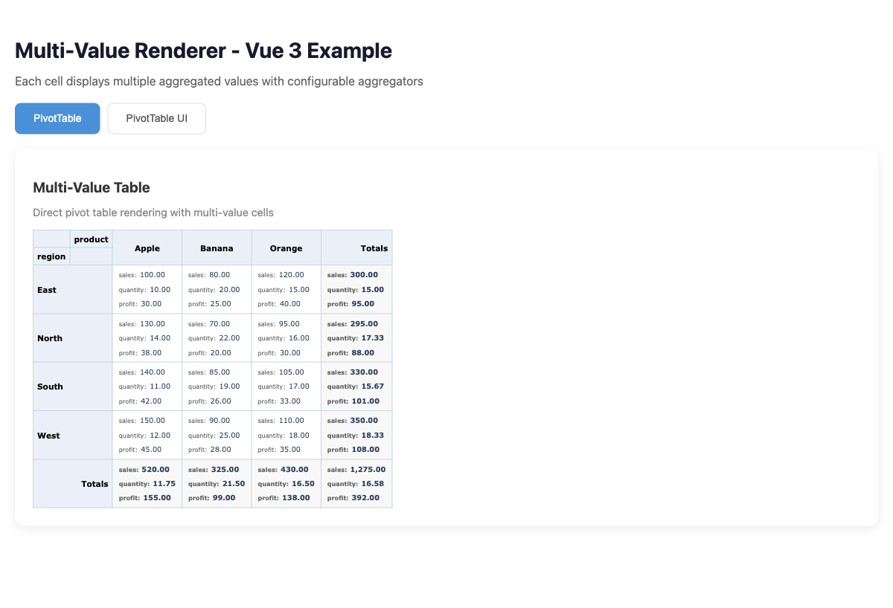
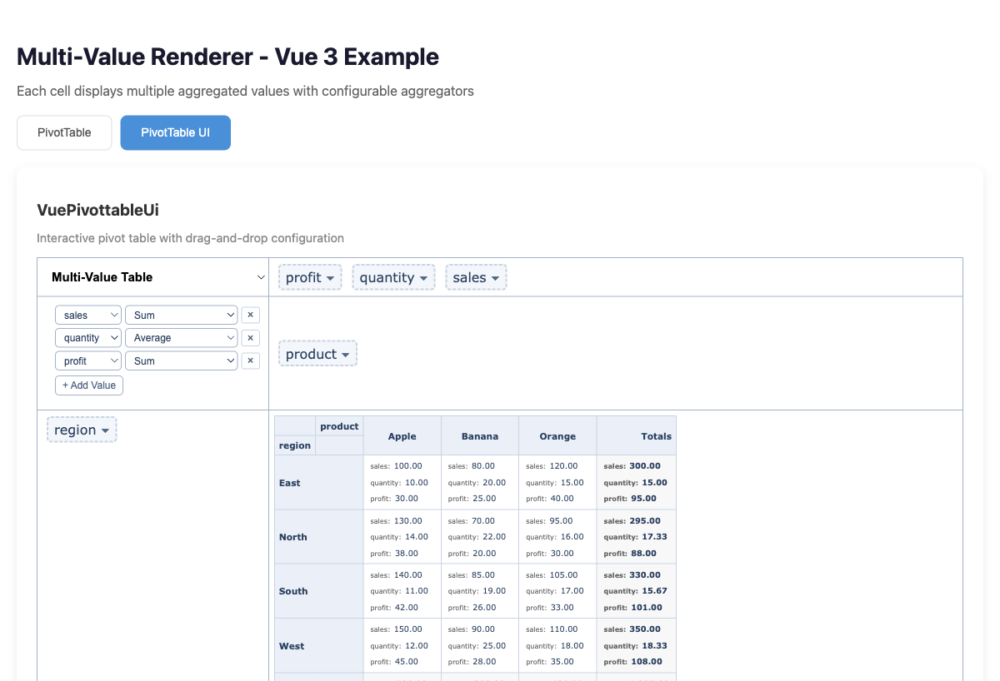
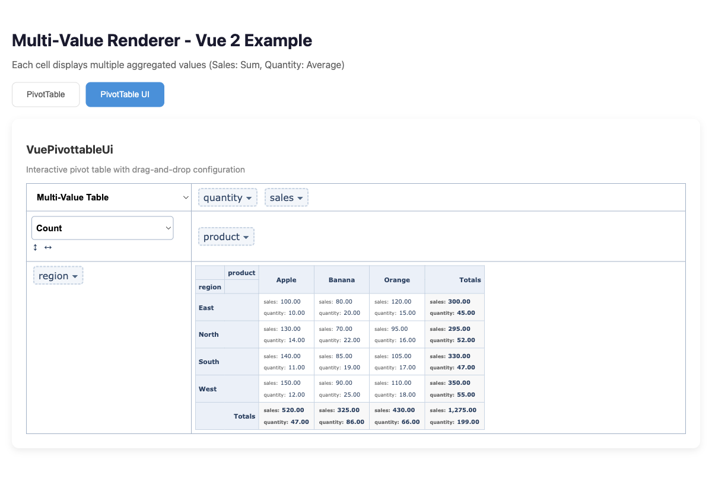

# @vue-pivottable/multi-value-renderer

Multi-value aggregator renderer for vue-pivottable. Display multiple aggregated values per cell, each with its own aggregation function.

## Screenshots

### Vue 3 - PivotTable



### Vue 3 - PivotTable UI



### Vue 2 - PivotTable


### Vue 2 - PivotTable UI



## Features

- **Multiple Values per Cell**: Display sales (Sum), quantity (Average), and more in a single pivot table cell
- **Vue 2 & Vue 3 Support**: Works with both vue-pivottable (Vue 2) and vue3-pivottable (Vue 3)
- **Flexible Layout**: Choose between vertical, horizontal, or compact cell layouts
- **Custom Value Labels**: Display user-friendly labels for each value column
- **Full Integration**: Works with existing vue-pivottable features like click callbacks, labels, and totals

## Installation

```bash
npm install @vue-pivottable/multi-value-renderer

# or
pnpm add @vue-pivottable/multi-value-renderer
```

## Usage

### Vue 3

```vue
<template>
  <VuePivottable
    :data="data"
    :rows="['region']"
    :cols="['product']"
    :vals="['sales', 'quantity']"
    :renderers="renderers"
    renderer-name="Multi-Value Table"
    :aggregator-map="aggregatorMap"
  />
</template>

<script setup>
import { VuePivottable, PivotUtilities } from 'vue-pivottable'
import { MultiValueRenderers } from '@vue-pivottable/multi-value-renderer'

const data = [
  { region: 'East', product: 'Apple', sales: 100, quantity: 10 },
  { region: 'East', product: 'Banana', sales: 80, quantity: 20 },
  // ...
]

const renderers = {
  ...MultiValueRenderers
}

// Different aggregation for each value
const aggregatorMap = {
  sales: 'Sum',
  quantity: 'Average'
}
</script>
```

### Vue 2

```vue
<template>
  <VuePivottable
    :data="data"
    :rows="['region']"
    :cols="['product']"
    :vals="['sales', 'quantity']"
    :renderers="renderers"
    renderer-name="Multi-Value Table"
    :aggregator-map="aggregatorMap"
  />
</template>

<script>
import { VuePivottable } from 'vue-pivottable'
import { MultiValueRenderers } from '@vue-pivottable/multi-value-renderer/vue2'

export default {
  components: { VuePivottable },
  data() {
    return {
      data: [
        { region: 'East', product: 'Apple', sales: 100, quantity: 10 },
        // ...
      ],
      renderers: { ...MultiValueRenderers },
      aggregatorMap: {
        sales: 'Sum',
        quantity: 'Average'
      }
    }
  }
}
</script>
```

## Props

### aggregatorMap

Map of value column names to aggregator names.

```js
{
  sales: 'Sum',
  quantity: 'Average',
  profit: 'Maximum'
}
```

### cellLayout

How to display multiple values in each cell:

- `'vertical'` (default): Stack values vertically
- `'horizontal'`: Display values side by side
- `'compact'`: Show values separated by " / "

### showValueLabels

Whether to show labels before each value (default: `true`).

### valueLabels

Custom display labels for value columns:

```js
{
  sales: 'Total Sales',
  quantity: 'Avg Qty'
}
```

## Styling

Import the included CSS for default styling:

```js
import '@vue-pivottable/multi-value-renderer/styles.css'
```

Or customize with your own CSS targeting these classes:

- `.multi-value-cell` - Cell container
- `.multi-value-item` - Individual value row
- `.multi-value-label` - Value label (e.g., "Sales:")
- `.multi-value-value` - The actual value
- `.layout-vertical`, `.layout-horizontal` - Layout modifiers

## Available Aggregators

The renderer uses aggregators from vue-pivottable. Common options:

- `Count`
- `Sum`
- `Average`
- `Minimum`
- `Maximum`
- `Median`
- `Sample Variance`
- `Sample Standard Deviation`

## License

MIT
